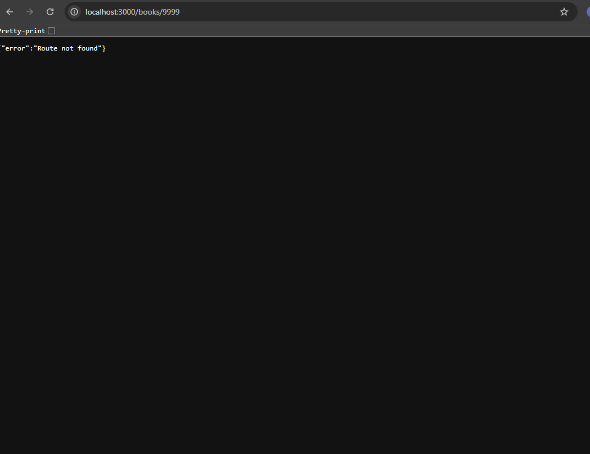
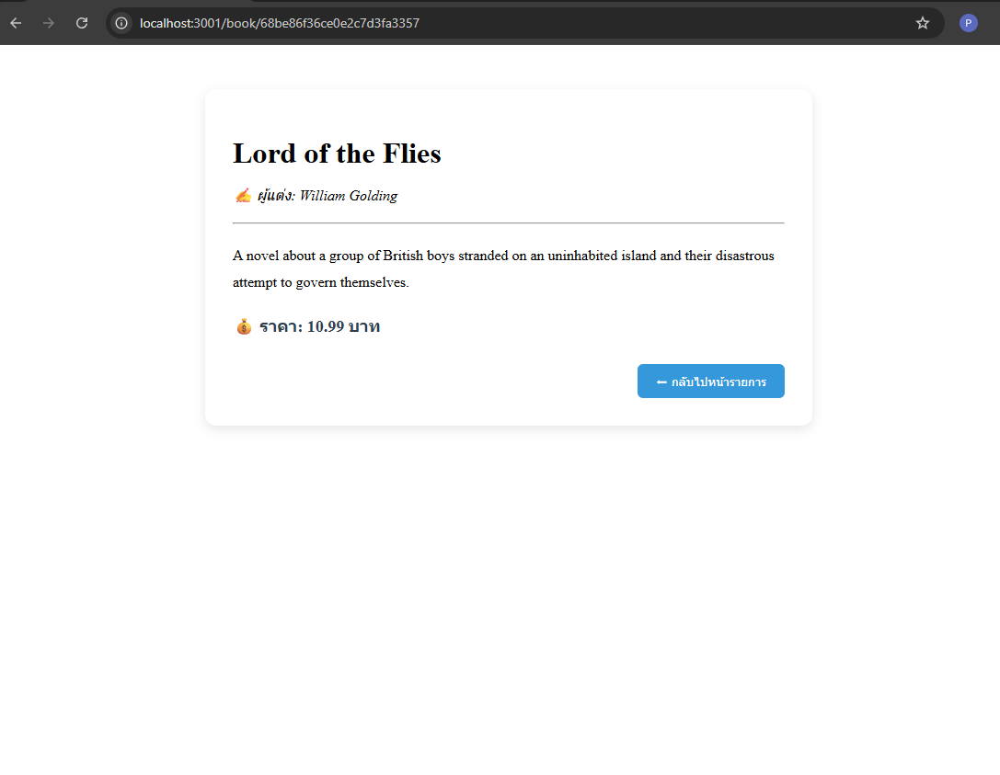

# Book Detail Page - Next.js Project

โปรเจกต์ตัวอย่างสำหรับ **หน้าแสดงรายละเอียดหนังสือ** ในแอป Next.js โดยใช้ **React Hooks** และ **Next.js App Router**

---

## 📌 รายละเอียดงาน

### หน้า `BookDetailPage`

* ใช้สำหรับ **แสดงรายละเอียดหนังสือทั้งหมด** เช่น:

  * ชื่อหนังสือ
  * ผู้แต่ง
  * รายละเอียด/คำอธิบาย
  * ราคา
* ใช้ **Next.js `useParams`** เพื่อดึง `id` ของหนังสือจาก URL
* ดึงข้อมูลหนังสือจาก API:

  ```
  GET http://localhost:3000/api/books/:id
  ```
* มี **สถานะโหลด** และ **สถานะไม่พบข้อมูล**

---

### ฟีเจอร์หลัก

1. **การโหลดข้อมูล**

   * ใช้ `useEffect` เพื่อ fetch ข้อมูลเมื่อ component ถูก mount
   * แสดง spinner loader ขณะรอข้อมูล

2. **กรณีไม่พบข้อมูล**

   * แสดงข้อความ ❌ พร้อมปุ่ม “กลับไปหน้ารายการ”

3. **การแสดงรายละเอียดหนังสือ**

   * แสดง **ชื่อหนังสือ** ขนาดใหญ่
   * แสดง **ผู้แต่ง** แบบตัวเอียง
   * แสดง **คำอธิบาย**
   * แสดง **ราคา** พร้อมไอคอน 💰
   * ปุ่ม **กลับไปหน้ารายการ**

4. **UI สวยงาม**

   * Card มีเงาและมุมโค้ง
   * Layout กึ่งกลางหน้าจอ
   * ปุ่มสีน้ำเงินพร้อมเอฟเฟกต์ hover (cursor pointer)

---

## 🖼 ตัวอย่างหน้าจอ (ใส่ screenshot ของคุณเอง)


**1. ไม่พบข้อมูล**



**2. แสดงรายละเอียดหนังสือ**




## ตัวอย่าง URL

```
/books/1
/books/2
```

---

## เทคโนโลยีที่ใช้

* Next.js 13+ (App Router)
* React (Hooks: `useState`, `useEffect`)
* TypeScript
* Fetch API
* CSS in JSX (สำหรับ loader)

---

## วิธีรันโปรเจกต์

```bash
# ติดตั้ง dependencies
npm install

# รันโปรเจกต์ในโหมด development
npm run dev
```

เปิดเบราว์เซอร์ที่:

```
http://localhost:3000
```
